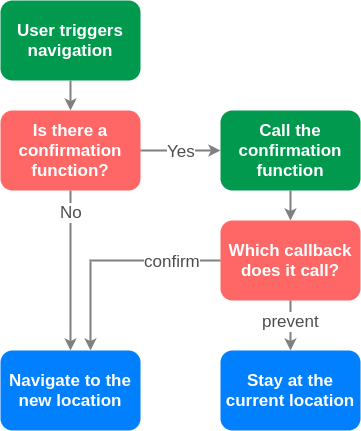

# Confirming Navigation

Normally, when a user clicks a link to another location within your application, hickory will transition directly to the new location. However, there are times that this behavior is undesirable. For example, if you have a page with a form, you may want to confirm that the user wants to leave the page while the form is being filled out. To handle this, Hickory's history objects provide you a `confirm` function, which allows you to register a function that will determine whether to confirm or prevent the navigation.



## The confirmation function

Your confirmation function can be anything you want it to be. It will be given three arguments: `info`, `confirm`, and `prevent`.

- `info` is an object with three properties: `to` is the location that the user is attempting to navigate to, `from` is the current location, and `action` is the type of navigation (`PUSH`, `REPLACE`, or `POP`).

- `confirm` is the function that the confirmation function should call when you want to allow the navigation to happen.

- `prevent` is the function that the confirmation function should call when you want to stop the navigation.

```js
function confirmation(info, allow, prevent) {
  let confirmed = window.confirm("Are you sure that you want to navigate?");
  if (confirmed) {
    allow();
  } else {
    prevent();
  }
}
```

In the example code above, we use `window.confirm` to get the user's confirmation. While you can do anything you want in your confirmation function, a blocking function like `window.confirm` is recommended so that the user cannot perform another navigation action before confirming/preventing the current navigation.

## Registering

Once you have created your confirmation function, all that you have to do to ensure that it is run is to pass it to a `history.confirm` call (where `history` is your Hickory history object).

```js
history.confirm(confirmation);
```

If you call `confirm` a second time, the new confirmation function will replace the current confirmation function.

### Unregistering

The confirmation block is removed by calling `confirm` with no arguments.

```js
history.confirm(confirmation);
// user will be prompted to confirm navigation

history.confirm();
// navigation will happen without confirmation
```

## Queued confirmations

The convenient thing about `window.confirm` is that it is a blocking operation. Until the user confirms/prevents the popup, they won't be able to interact with the browser. This means that they cannot click another link or the browser's forward/back buttons. If you use a confirmation function that does not block, a user could trigger another navigation before confirming/preventing the current navigation. This can put your application into an undefined state.

How should you deal with this? The simplest solution would be to create a module that exports your confirmation function and keeps an internal reference to whether or not there is a navigation being blocked by a confirmation function. When there is already a navigation being blocked, then you could automatically prevent any new navigations.

```js
// confirm.js

let active = false;

export default function confirmNavigation(info, confirm, prevent) {
  if (active) {
    prevent();
  }
  active = true;
  // Your confirmation code would be run here. For instance, you might
  // render a form with confirm/prevent buttons. It is important that after
  // confirming/preventing the navigation, you also reset the active variable
  // to false.
  renderConfirmationForm(
    () => {
      active = false;
      confirm();
    },
    () => {
      active = false;
      prevent();
    }
  );
}
```

This of course is not the only solution to the queued confirmation problem. For other design choices, such as dropping old navigation and only performing the newset one, you will need to come up with your own implementation. The important thing to remember is that if you do not use a blocking function, you _will_ need to consider what happens in this situation.

## Page Unload

Hickory only adds navigation confirmation for navigation within your application. It will not prevent navigation to URIs outside of your application. If you want to do that, you will have to add your own event listener to the window for the `beforeunload` event. There are certain possible [limitations](https://developer.mozilla.org/en-US/docs/Web/API/WindowEventHandlers/onbeforeunload#Notes) to what you can do in your `beforeunload` event handler, so you should be familiar with those if you plan to use this.
